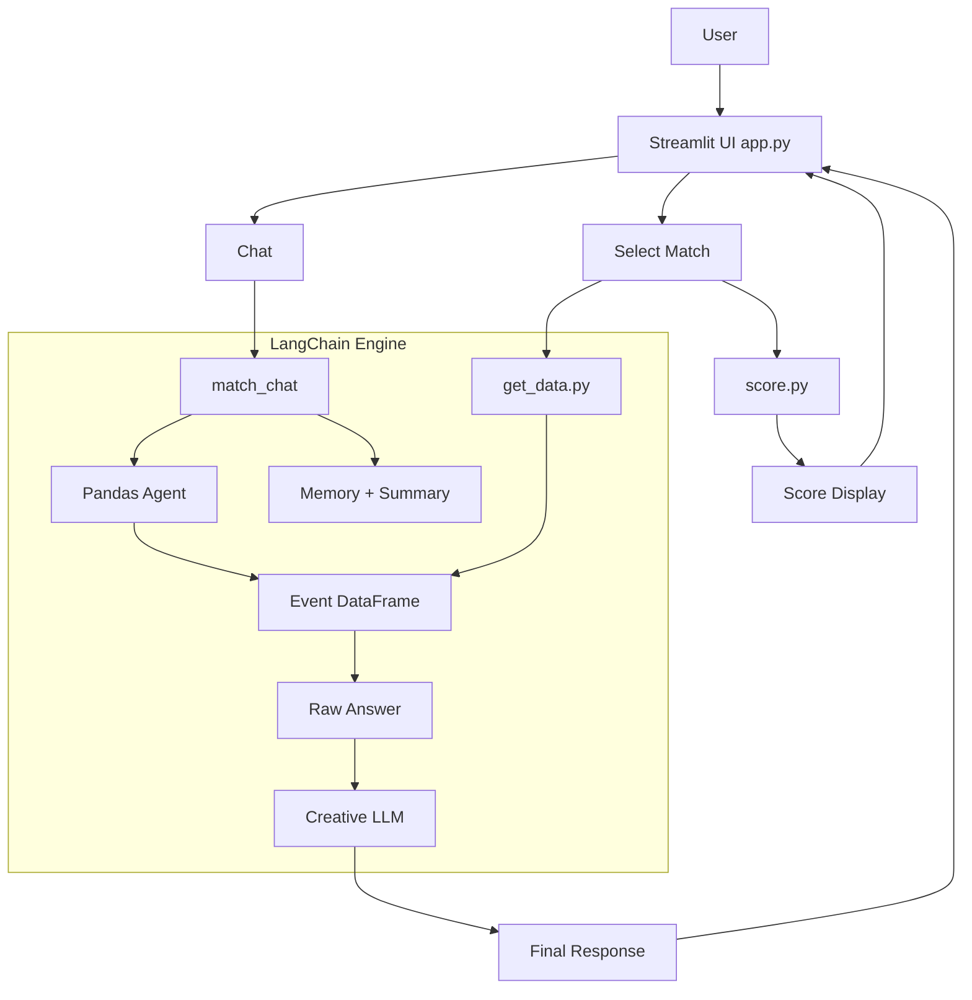

# ⚽ Football Match Chatbox

### Overview
**Football Match Chatbox** is an interactive Streamlit application that lets you explore real football match data using natural language. By leveraging *LangChain agents*, *StatsBomb data*, and custom logic, the app allows users to ask questions about events like goals, fouls, or cards and receive responses in the tone of a sports commentator.


## 🚀 Features

- **Match Selection**: Choose competition, season, and match.
- **Live Lineups & Info**: See the squads and contextual details.
- **Score Display**: Automatically detects and shows the final score.
- **Chat with Match Data**: Ask anything about the match — goals, xG, cards, key moments — and get vivid, human-like responses.
- **Agent-Powered QA**: Combines factual reasoning (LangChain + Pandas) with conversational storytelling (ChatOpenAI + Memory).


## 📂 Project Structure

```bash
football-chatbox/
│
├── app.py                     # Main Streamlit app
├── match_agent.py             # LLM agent logic (LangChain setup)
├── score.py                   # Goal counting and display
├── get_data.py                # Functions to fetch match data (from JSON or API)
├── LLM_API_KEY/
│   └── config.yaml            # Contains OpenAI API key
├── assets/
│   └── FootballChatbox.jpg
├── requirements.txt       # Dependencies
└── README.md
```

## 📦 Setup Instructions

### 1. Clone the Repository

```bash
git clone https://github.com/PyaMaster/FootballMatchChatbox.git
cd football-chatbox
```

### 2. Install Dependencies

Create a virtual environment and install packages:

```bash
pip install -r requirements.txt
```

Or install manually:

```bash
pip install streamlit pandas langchain openai pyyaml
```

### 3. Set Your OpenAI API Key

Put your OpenAI API Kay in the configuration file at `LLM_API_KEY/config.yaml`:

```yaml
openai_api_key: "your-api-key-here"
```

## ▶️ Running the App

```bash
streamlit run app.py
```
Then open the browser link to explore matches and chat with the bot.
1. Choose a competition
2. Pick a season
3. Select a match
4. Start chatting with the match agent!

## 🧠 How It Works

Behind the scenes, the app uses:

- `StatsBomb JSON`: Structured event & lineup data.
- `LangChain` agents:
  - A **factual agent** queries the data (Pandas agent).
  - A **creative LLM** rephrases the output like a football analyst.
- **Memory Buffer**: Keeps track of the conversation for flow and coherence.
- `Streamlit`: UI for seamless interaction.

You can view the architecture below.



## ✍️ Example Chat

> **User:** Who scored the opening goal?  
> **Chatbot:** It was a sharp move down the right — João Pedro latched onto a cutback and buried it with a clean finish. Big moment early in the first half.

> **User:** How did the xG look?  
> **Chatbot:** Decent chances overall. The winner came from an xG around 0.6 — definitely a high-probability strike.

## 🤖 Technologies Used

- **LangChain** (agents, memory, chains)
- **OpenAI GPT-4** via `ChatOpenAI`
- **Streamlit** for UI
- **Pandas** for data wrangling
- **StatsBomb** match data


## 🌱 Future Improvements

**Improve Prompt Design:**
Optimize prompt wording for more vivid and accurate responses.

**Event-Specific Handling:**
Detect event types (e.g., goals, fouls, subs) and use specialized prompts for each.

**Smarter Data Exploration:**
Use follow-up (derivative) questions based on the user query to extract deeper insights and improve answers.

**Enhanced UI/UX Design:**
Redesign the Streamlit interface for a more polished, user-friendly experience.


## 🙌 Acknowledgments

- [**StatsBomb**](https://github.com/statsbomb/statsbombpy) for open event data.
- **LangChain** for enabling agent-based reasoning.
- **OpenAI** for the LLM backend.


## 📬 Contributions
If you’d like to improve the agent’s prompt, integrate a better memory system, or suggest UI enhancements, feel free to open an issue or PR.

## 📜 License 
This project is licensed under the MIT License. See the [LICENSE](/LICENSE.txt) file for details.
